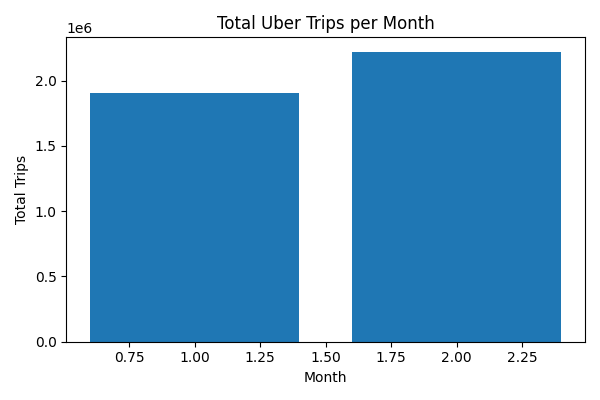
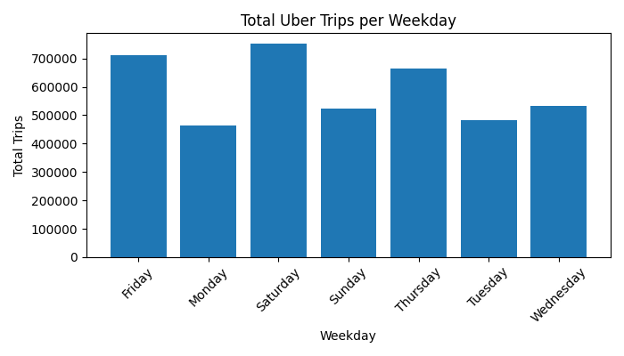
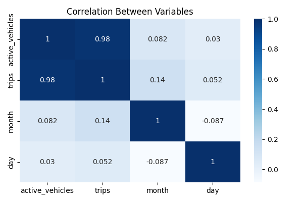
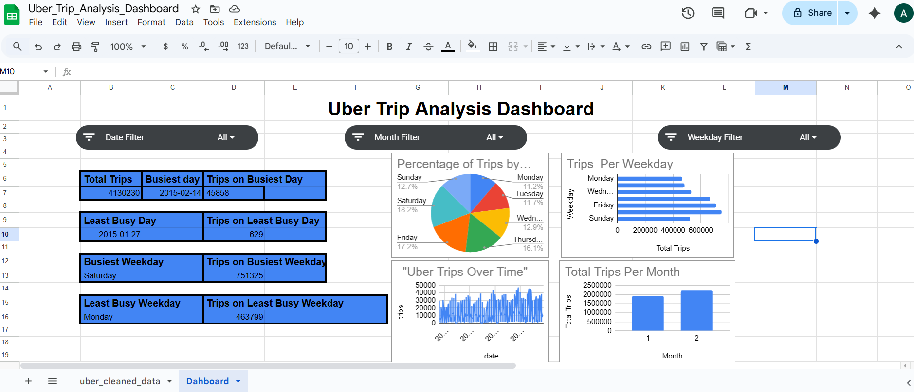
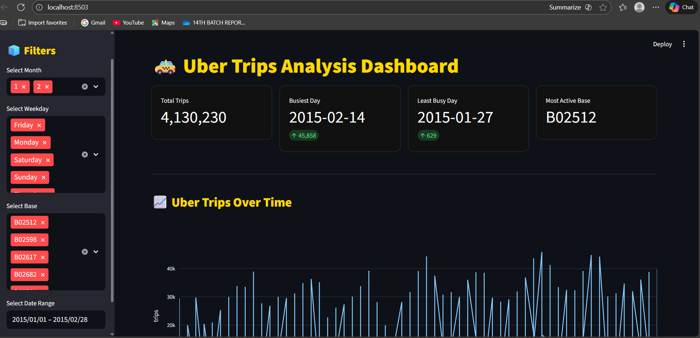
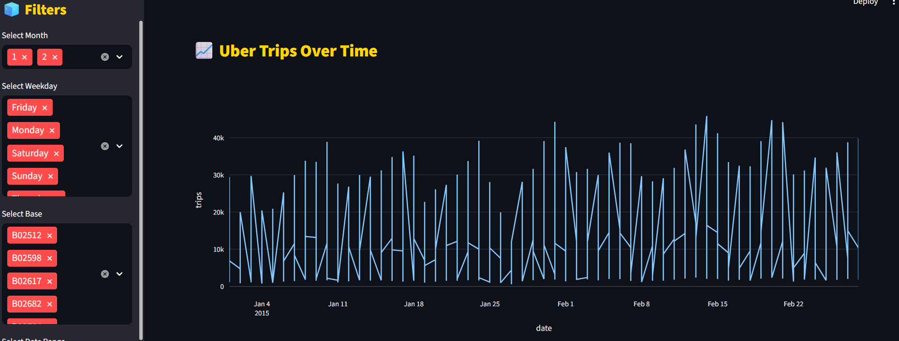
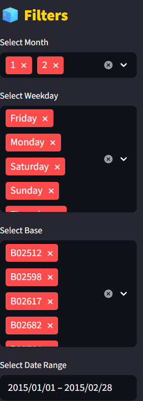
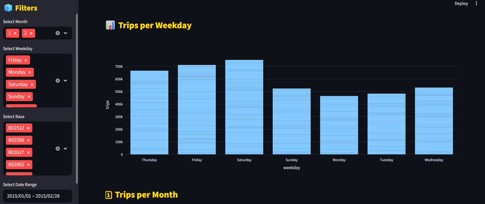
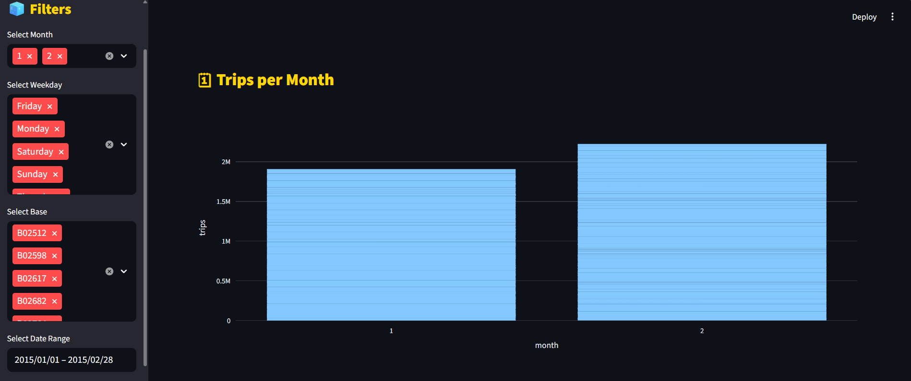
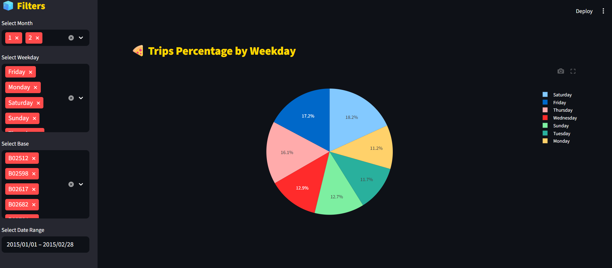

🚖 Uber Trip Analysis

📌 Project Overview
This project focuses on analyzing Uber trip data to uncover meaningful insights related to trip patterns, demand trends, peak hours, and vehicle activity.
The analysis is performed using Python, SQL, Excel, and data visualization techniques, with a Streamlit dashboard for interactive exploration.
The goal of this project is to demonstrate end-to-end data analysis skills, from raw data processing to insights and visualization.

🛠️ Tech Stack
Python (Pandas, NumPy, Matplotlib, Seaborn)
SQL (SQLite)
Excel
Streamlit (Dashboard)
VS Code
📂 Project Structure
Copy code

Uber_Trip_Analysis/
│
├── dataset/                # Raw Uber dataset
│
├── excel/                  # Cleaned data & Excel analysis
│
├── python/                 # Python analysis scripts
│   └── uber_analysis.py
│
├── sql/                    # SQL database and queries
│   ├── uber.db
│   └── queries.sql
│
├── images/                 # Saved plots & visualizations
│
├── dashboard/              # Streamlit dashboard
│   └── app.py
│
├── report/                 # Screenshots & report files
│
└── README.md

📊 Data Analysis Performed

🔹 Python Analysis
Data cleaning and preprocessing
Feature engineering (weekday, month, hour)
Trip distribution analysis
Time-based trend analysis
Visualization using Matplotlib & Seaborn
Saved plots for documentation
Python file:

python/uber_analysis.py

🔹 SQL Analysis
SQL queries were written using SQLite to analyze the data efficiently.
Queries include:
Total number of trips
Trips per month
Trips per weekday
Peak hour analysis
Active vehicles per day

SQL file location:

sql/queries.sql

🔹 Excel Analysis

Pivot tables
Summary statistics
Dashboard-style analysis

Excel files are stored in:

excel/

📈 Visualizations
All generated plots are saved inside the images folder.
Examples include:
Trips per month
Trips per weekday
Trips over time
Correlation heatmap
Active vehicles trend

🖼️ Sample Visualizations

### Trips Per Month

### Trips Per Weekday

### Trips Over Time

### Correlation Heatmap

### Active Vehicles

🖥️ Streamlit Dashboard

An interactive dashboard was built using Streamlit to visualize Uber trip insights dynamically.

To run the dashboard:

streamlit run dashboard/app.py

📸 Dashboard Screenshots

### Dashboard Preview

📌 Key Insights
Highest number of trips occur during peak working hours
Weekdays show higher demand compared to weekends
Monthly trends indicate seasonal variations
Strong correlation between time and trip volume

🚀 Conclusion
This project demonstrates an end-to-end data analysis workflow, combining Python, SQL, Excel, and visualization tools to extract actionable insights from real-world Uber trip data.

👤 Author
Archana Bharadwaj