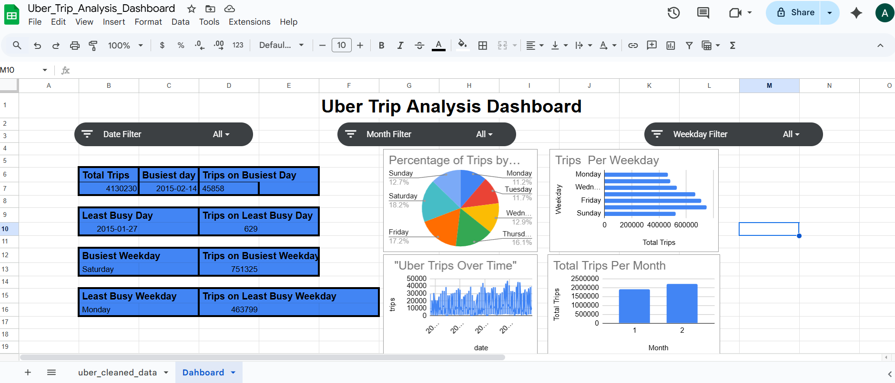
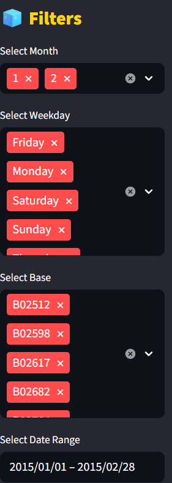
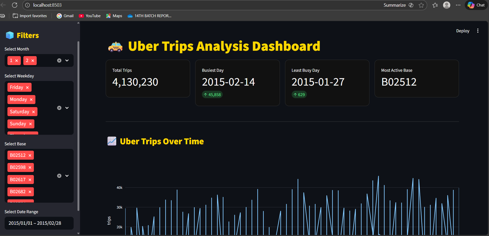
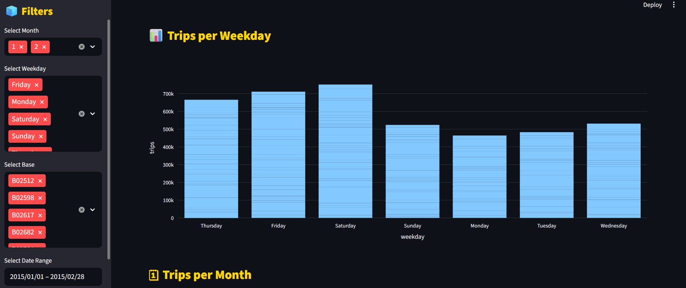
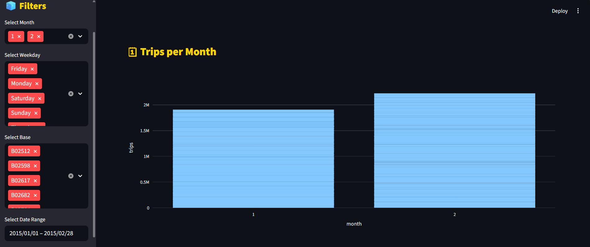
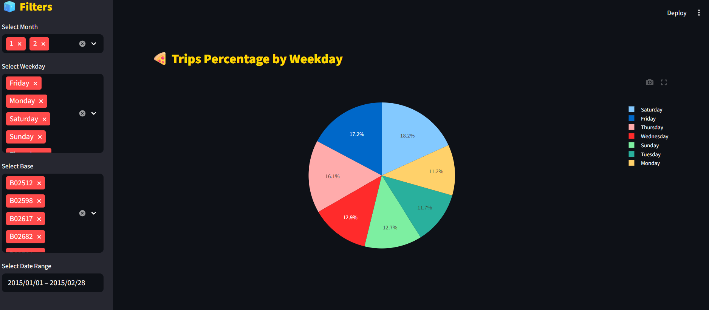

🚖 UBER TRIP ANALYSIS – PROJECT REPORT

Submitted by: B ARCHANA

---

📌 1. Introduction

The objective of this project is to analyze Uber trip data to understand trip patterns, busiest days, least busy days, monthly trends, and weekday trends.
This analysis helps in understanding rider demand, peak times, and operational behavior.

---

📌 2. Dataset Description

The dataset contains the following columns:

dispatching_base_number

date

active_vehicles

trips

month

day

weekday

Dataset Used: uber_cleaned_data.csv

---

📌 3. Tools & Technologies

Python

Pandas

Google Sheets (Excel Dashboard)

SQL

Streamlit (Web App Dashboard)

Plotly (Charts)

---

📌 4. Excel Dashboard

The Excel dashboard visualizes:

Total trips

Busiest day

Least busy day

Busiest weekday

Least busy weekday

Trips per weekday (bar chart)

Percentage of trips by weekday (pie chart)

Trips per month

Uber trips over time

📸 Excel Dashboard Screenshot

---

📌 5. Python Analysis

Performed calculations:

Total trips

Busiest day & number of trips

Least busy day & number of trips

Busiest weekday

Least busy weekday

Month-wise and week-wise trip distribution

---

📌 6. Streamlit Dashboard

A web-based dashboard was developed using Streamlit.
Features include:

Filters for Month, Weekday, Base Number

Interactive charts:

Trips Over Time

Trips per Weekday

Trips per Month

Percentage of Trips

KPIs Display:

Total Trips

Busiest Day

Least Busy Day

Trips on busiest/least days

Most Active Base

📸 Streamlit Dashboard Screenshot

---

📌 7. Insights

Saturday is the busiest weekday.

Monday is the least busy weekday.

February 14, 2015 had the highest trips (45,858).

January 27, 2015 had the lowest number of trips (629).

Month-wise:

Month 2 has maximum trips.

Month 1 has fewer trips compared to month 2.

---

📌 8. Conclusion

The analysis provides clear insights into Uber’s trip demand patterns.
Visual dashboards make it easier to observe peak periods and operational trends, helping optimize resources for future planning.